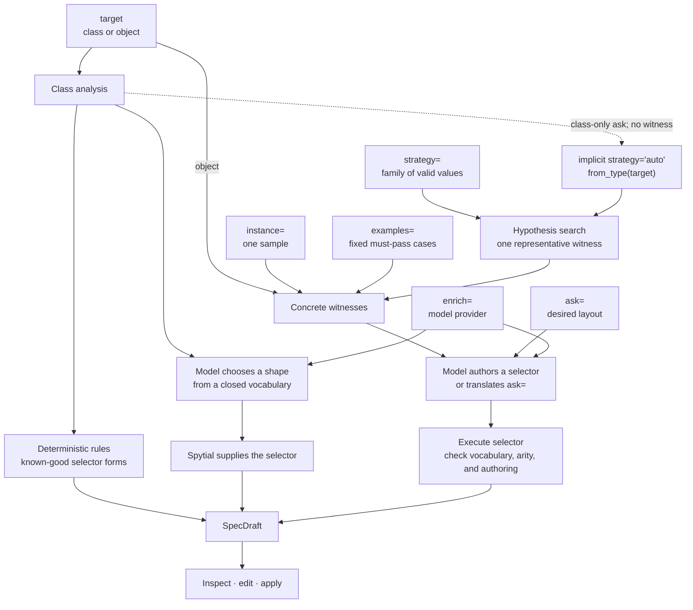

# Suggesting a Spytial specification

Writing a Spytial specification from a blank page requires two decisions at
once: what the diagram should look like, and how to express that intent using
Spytial selectors and directives. Often the missing rule only becomes obvious
after seeing it violated: diagonal children prompt “put every child directly
below its parent”; a visible parent pointer prompts “hide that implementation
detail.”

`spytial.suggest` replaces the blank page with a concrete, editable
`SpecDraft`. The design claim is simple: a default need not be correct to be
useful. If it is right, apply it. If it is wrong, inspect its selectors and
correct something specific.

Suggestion is local and deterministic by default. Models and Hypothesis-backed
witness search are optional and load only when requested.

## High-level idea

The inputs tell Spytial what structure it can inspect. The proposal layers get
more freedom only when Spytial has a stronger way to check their output.



The left side establishes evidence: a class shape and, when available,
concrete objects. The right side turns that evidence into proposals. Static
rules use selector forms supplied by Spytial. A model may choose among known
spatial shapes without seeing an instance. Giving a model freedom to author a
selector requires concrete witnesses so Spytial can execute and validate it.

## Quick start

Consider an ordinary Python tree:

```python
from dataclasses import dataclass
from typing import Optional

import spytial
from spytial.suggest import suggest


@dataclass
class TreeNode:
    value: int
    left: Optional["TreeNode"] = None
    right: Optional["TreeNode"] = None


root = TreeNode(8, TreeNode(3), TreeNode(10))
draft = suggest(root)
print(draft.to_source())
```

The deterministic analyzer proposes a conventional tree layout:

```python
@spytial.orientation(
    selector='left - (univ -> NoneType)',
    directions=['below', 'left'],
)
@spytial.orientation(
    selector='right - (univ -> NoneType)',
    directions=['below', 'right'],
)
@spytial.attribute(field='value')
@spytial.hideAtom(selector='NoneType')
@spytial.flag(name='hideDisconnected')
```

`to_source()` emits one-line decorators with explanatory comments; they are
expanded above for readability. Paste and edit the generated source, or apply
the draft to the class immediately:

```python
draft.apply()
spytial.diagram(root)
```

If the proposed geometry is close but wrong, state the correction:

```python
from spytial.suggest import ClaudeCode

draft = suggest(
    root,
    ask="put every child directly below its parent",
    enrich=ClaudeCode(),
)
```

The admitted request selects `left + right` and uses `below`. The overlapping
below-left and below-right rules move to `draft.alternatives` rather than being
discarded.

Both import styles are supported. The `suggest` subpackage is lazy and callable:

```python
import spytial

draft = spytial.suggest(root)
```

```python
from spytial.suggest import suggest

draft = suggest(root)
```

## What each parameter does

The complete interface is:

```python
suggest(
    target,
    *,
    instance=None,
    examples=None,
    strategy=None,
    enrich=None,
    ask=None,
    registry=None,
)
```

The inputs are different kinds of evidence. In particular, `examples=` and
`strategy=` are not two spellings of the same idea.

| Parameter | Meaning | Use it when |
| --- | --- | --- |
| `target` | Required. A class to analyze, or an object. An object is shorthand for its class plus one concrete sample. | You always provide this. |
| `instance` | One explicit sample for a class target. It exposes runtime structure that annotations and `__init__` do not. It is also the default selector-validation witness. | You have a representative object already. |
| `examples` | Particular, fixed cases. Model-authored selectors must validate on every buildable example. | Awkward or important cases must not be lost during suggestion. |
| `strategy` | A Hypothesis strategy describing a family of values. Suggestion performs bounded search for one representative witness. The special value `"auto"` uses `hypothesis.strategies.from_type(target)`. | Valid instances require generation, or a single hand-picked instance would be misleading. |
| `enrich` | The model provider: a model identifier, a callable provider, or a built-in such as `ClaudeCode()` or `Codex()`. There is no ambient model. | Field names or domain conventions carry intent beyond structural types. |
| `ask` | A natural-language statement of the desired layout. It is translated by `enrich=` and is authoritative over overlapping geometric suggestions. | You can describe the correction more easily than write its selector. |
| `registry` | An alternate deterministic heuristic registry. | A project has its own field conventions or layout policy. |

### Choose the evidence you have

Static analysis of a type needs no instance, model, or optional dependency:

```python
draft = suggest(TreeNode)
```

Pass an object—or a type plus `instance=`—when runtime values reveal structure
that static inspection cannot recover:

```python
draft = suggest(root)
draft = suggest(TreeNode, instance=root)  # equivalent evidence
```

Use `examples=` for fixed cases every authored selector must survive:

```python
draft = suggest(
    TreeNode,
    examples=[empty_tree, balanced_tree, zig_zag_tree],
    enrich=model,
)
```

Use `strategy=` for a family of valid values. One generated witness is added to
the fixed validation set:

```python
draft = suggest(
    RedBlackNode,
    examples=[empty_tree, deletion_corner_case],
    strategy=valid_red_black_trees(),
    enrich=model,
)
```

For a class-only request, `strategy="auto"` is implicit:

```python
draft = suggest(
    TreeNode,
    ask="put every child below its parent",
    enrich=ClaudeCode(),
)
```

Hypothesis derives a strategy from `TreeNode`. For a recursive class, Spytial
first searches for a value that populates every public recursive root field,
then for any non-leaf value, and finally for any buildable value. Supply a
custom strategy when the type has invariants Hypothesis cannot infer.

Install witness search separately:

```console
pip install "spytial_diagramming[suggest-search]"
```

The ordinary `suggest(TreeNode)` path does not import Hypothesis.

## Working with `SpecDraft`

`suggest()` returns a draft rather than mutating the target class. Its main
collections expose both the proposal and the reasoning behind it:

| Member | Contents |
| --- | --- |
| `draft.suggestions` | Current proposed `Suggestion` objects, including disabled low-confidence rows. |
| `draft.enabled()` | The suggestions currently enabled by default. |
| `draft.alternatives` | Conflict losers and superseded geometry, preserved for inspection or recovery. |
| `draft.notes` | Missing evidence, skipped enrichment, validation results, and other diagnostics. |

Each `Suggestion` records its `directive`, `kwargs`, `confidence`, `rationale`,
`source_field`, whether it is enabled, and whether it came from a deterministic
rule or a model.

Render or apply the draft in four ways:

| Call | Result |
| --- | --- |
| `draft.to_source()` | A pasteable stack of `@spytial.*` decorators. |
| `draft.to_registry()` | A `{"constraints": [...], "directives": [...]}` registry dictionary. |
| `draft.apply()` | Decorates the target class live and returns it. |
| `draft` in Jupyter | A rich panel showing directives, rationales, alternatives, and notes. |

These methods use enabled suggestions by default. Pass `enabled_only=False` to
include disabled candidates. `to_source(with_comments=False)` omits generated
rationales.

Review the draft before `apply()`: application installs decorators on the class
and therefore affects subsequent diagrams of its instances.

## How deterministic suggestion decides

The analyzer reads field types, names, assignments in `__init__`, and optional
instance samples. Built-in heuristics map common structures to directives:

| Field shape | Suggested treatment |
| --- | --- |
| `left` and `right` of the same node type | Orient below-left and below-right. |
| One self-referential field | Orient below. |
| A list or dictionary of same-type children | Derive parent-child pairs and orient below. |
| `next` and `prev` of the same type | Orient `next` right and hide the reverse link. |
| `parent` or another back-pointer | Hide it when child edges already expose the structure; otherwise orient above. |
| A scalar such as `value`, `key`, or `name` | Fold it into the node with `attribute`. |
| An `Enum`-typed field | Propose one disabled `atomStyle` per member. |
| Nullable children | Hide `NoneType` atoms. |

Nullable edge selectors remove only `None` targets—for example,
`left - (univ -> NoneType)`. This retains edges to subtype instances that an
exact type intersection would incorrectly discard.

When child edges already describe the structure, a `parent` field duplicates
them and is hidden by default. Its “place above” orientation remains in
`draft.alternatives`. When `parent` is the only structural link, the orientation
wins instead.

## Model providers

`enrich=` always names a provider explicitly. There is no ambient model and no
model call on the default path.

### Claude Code

`ClaudeCode` uses an installed and authenticated `claude` CLI, so it needs no
Spytial model extra or API key:

```python
from spytial.suggest import ClaudeCode, suggest

draft = suggest(Ticket, enrich=ClaudeCode())
draft = suggest(Ticket, enrich=ClaudeCode(model="opus"))
```

If `ANTHROPIC_API_KEY` is set, the CLI may use metered API billing instead of a
Claude subscription. Consult the CLI's current authentication behavior before
choosing a provider.

### Codex

`Codex` uses an installed and authenticated `codex` CLI and its native
JSON-schema output:

```python
from spytial.suggest import Codex, suggest

draft = suggest(Ticket, enrich=Codex())
```

### A model identifier through `llm`

A string is resolved by Simon Willison's `llm` library. This supports hosted
providers and local models through their respective plugins:

```console
pip install "spytial_diagramming[suggest-llm]"
llm install llm-anthropic
llm keys set anthropic
```

```python
draft = suggest(Ticket, enrich="claude-sonnet-4-6")
draft = suggest(Ticket, enrich="llama3.2")  # for example, through Ollama
```

### A custom provider

A provider is any callable with the signature `(prompt, *, schema) -> dict`.
Helpers are available for text-only models:

```python
from spytial.suggest.providers import extract_json, instruct_json


def my_provider(prompt, *, schema):
    text = call_some_model(instruct_json(prompt, schema))
    return extract_json(text)


draft = suggest(Ticket, enrich=my_provider)
```

The shape tier sends class, field, and type names. When instances are present,
the selector-authoring tier additionally sends relational names, arities, and
atom counts. Field values stay local and are used only for selector evaluation.
With a local provider, nothing leaves the machine.

## Engineering considerations

### Give inference only as much freedom as can be checked

Suggestion has three layers:

1. The deterministic layer recognizes common program structures and emits
   selector forms maintained by Spytial.
2. The model shape layer chooses `orientation`, `cyclic`, `group`, or no shape,
   with arguments from a closed vocabulary. Spytial writes the selector.
3. With concrete witnesses, the model may author selectors or translate
   `ask=`. Those candidates must execute before they enter the draft.

The governing principle is:

> More generative freedom requires a stronger checker.

Valid shape enrichment becomes the active geometry for the fields it addresses;
the deterministic geometry it replaces becomes an alternative. If enrichment
fails, the deterministic draft remains usable and `draft.notes` explains what
was skipped.

Model-authored selector candidates from unsolicited enrichment remain disabled
until reviewed. An explicit `ask=`, by contrast, is enabled when admitted
because the user requested it.

### Check denotation, not just syntax

A model-authored selector must:

1. use a supported directive and in-vocabulary arguments;
2. parse, return a non-empty result, and have the directive's exact arity on
   every buildable validation example; and
3. pass the same authoring checks as handwritten decorators.

An orientation selector must denote pairs; `hideAtom` must denote atoms. This
arity check matters because an invented bareword can parse as an arity-zero
literal rather than fail syntactically.

An explicit request gets one repair attempt using concrete validation
diagnostics. If no part of the request can be admitted, `suggest` raises
`spytial.suggest.AskError`. A compound request may admit the validated parts and
record any remainder in `draft.notes`.

### Preserve alternatives and make failure asymmetric

When an explicit ask supersedes overlapping geometry, the previous suggestions
move to `draft.alternatives`; they are not destroyed. Overlap is checked by
evaluating the intersection of selectors over the available witnesses rather
than comparing selector strings.

Optional enrichment may fail and leave the deterministic draft unchanged. An
explicit `ask=` must either install at least one validated directive or raise an
error. The distinction prevents a requested correction from disappearing
silently.

### A witness is not a proof

`examples=` checks the particular cases supplied. `strategy=` contributes one
representative generated witness. Neither proves that a selector works for
every value.

This distinction is important for empty structures. A child selector returning
no pairs on a leaf does not refute “put every child below its parent”; the rule
is merely vacuous on that object. Auto-generation therefore prefers a populated
recursive witness that exercises the selector.

Evaluation can establish that a selector denotes real atoms or edges in the
witnesses. It cannot establish that `below` expresses the user's intent. Human
judgment remains the final specification.

### Keep the default path cheap and local

Static suggestion requires no model, network, Hypothesis, or headless
evaluator. Provider resolution, witness search, and selector evaluation load
only when their corresponding arguments request them.

Selector authoring and `ask=` require a `node` runtime on `PATH` (or a binary
named by `SPYTIAL_NODE`) so Spytial can run the vendored headless evaluator.

## Extending deterministic suggestion

The built-in rules are functions registered with `@heuristic`. Add project
conventions or domain-specific field names using the same interface:

```python
from spytial.suggest import Suggestion, heuristic


@heuristic(scope="field", priority=100)
def color_by_status(field, cls_info):
    if field.name == "status" and field.enum_members:
        return [
            Suggestion(
                directive="atomStyle",
                kwargs={
                    "selector": (
                        f"{{ x : {cls_info.cls.__name__} | "
                        f"@:(x.status) = active }}"
                    ),
                    "borderStyle": {"color": "seagreen"},
                },
                confidence="high",
                rationale="active status → green",
                source_field="status",
            )
        ]
    return []
```

Field-scope heuristics receive `(FieldInfo, ClassInfo)`; class-scope heuristics
receive `ClassInfo` and can recognize multi-field patterns. Higher priority wins
a same-field conflict, while the losing suggestion becomes an alternative.

Pass `suggest(cls, registry=my_registry)` for an isolated rule set. Use
`DEFAULT_REGISTRY.copy()` to extend the built-ins without changing the global
registry.

## Limits

Program structure is evidence for a spatial specification, not the
specification itself. `suggest` cannot recover a tree represented only by index
arithmetic in an array-backed heap. A model can choose the wrong interpretation
of a real field. A selector can pass every supplied example and fail on the next
one.

These limits are why the result is a `SpecDraft`: rationales and provenance are
visible, alternatives survive, authored selectors run before admission,
explicit asks fail loudly, and the user decides what becomes the final
specification.
